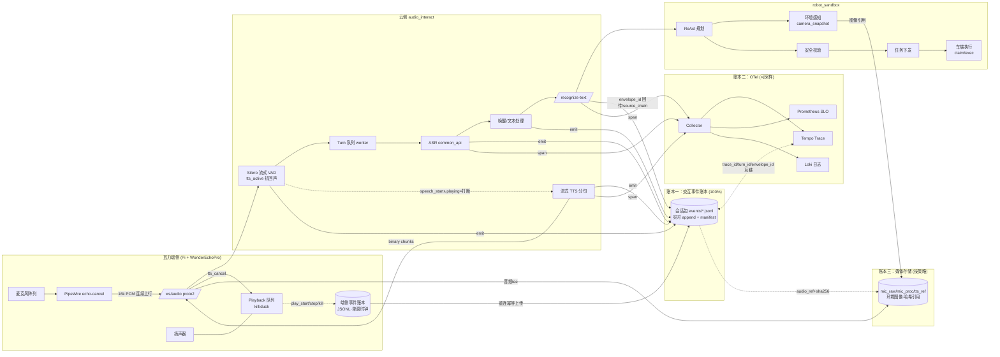
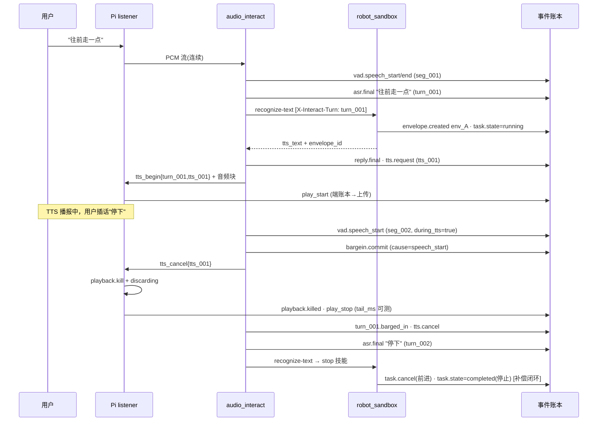

# 瓦力语音交互全链路 Trace 设计方案（端侧 → 云侧）

> 覆盖链路：音频采集 — VAD — ASR — 文本处理(唤醒/路由) — 环境感知 — 规划与执行 — 回复生成 — TTS 播报 — 全双工打断 — 回溯审计。
>
> 本文包含四部分：① 最理想且鲁棒的目标架构（"三账合一、职责分离"）；② 当前工程实现盘点（逐文件对照）；③ 差距与改进路线（P0/P1/P2）；④ 方案图与展示效果图。
>
> 关联文档：`audio_interact/session_data_persistence.md`（落盘 v1.1）、
> `docs/audio-interact-fullduplex-golden-spec.md`（全双工金标）、
> `docs/wonderecho-fullduplex-bargein-plan.md`（打断实现计划）。

---

## 1. 核心架构判断

实时语音交互系统的可观测性**不能**用单一手段解决：

1. **不能把全部信息塞进传统分布式 Trace Span。**
   Span 是"请求-响应"模型，生命周期绑定采样决策；而语音交互是**长会话 + 事件流 + 状态机**：
   VAD 边沿、打断确认、TTS 播放启停这些事实一旦被采样丢弃，交互过程就无法还原，
   打断这类跨 turn 的因果关系（turn N 的 TTS 被 turn N+1 的 speech_start 杀掉）也无法用父子 Span 表达。
2. **不能只依赖日志还原交互过程。**
   文本日志没有强 schema、没有稳定 ID、没有统一时钟，端侧日志（`print` + journalctl）与云侧
   会话包之间无法可靠 join；回放、评测、归因都需要机器可读的事件账本。
3. **音频/图像等大对象既是最强证据也是最大负担**，必须与事件、Trace 分离存储，
   按授权与场景分级保留，账本只存引用 + 哈希。

因此采用**"三账合一、职责分离"**的数据体系：

| 数据体系 | 作用 | 完整性要求 | 典型数据 |
|---|---|---|---|
| **交互事件账本 (Interaction Event Journal)** | 还原事实、状态机、打断、执行和补偿 | 关键事件 **100%**（不采样、append-only、崩溃可恢复） | VAD 边沿、ASR final、打断确认、TTS 播放启停、命令状态迁移、回滚记录 |
| **OpenTelemetry Trace / Metrics / Logs** | 性能诊断、依赖分析、SLO 和故障定位 | 可采样 | Span、Span Event、Histogram、结构化日志 |
| **媒体与大对象存储** | 保存经授权的原始证据和模型输入输出 | 默认不保存或严格条件保存，账本持引用 | 音频片段、环境图像、声学特征、模型输入输出快照 |

三账通过**统一 ID 体系 + 统一时间轴**合一：任何一条 Span、任何一个 WAV，都能通过
`trace_id / turn_id / envelope_id` 回到账本里对应的事实序列；反之账本里每个事件都能
下钻到性能明细和原始音频。

---

## 2. 统一 ID 体系与传播（三账合一的前提）

### 2.1 ID 层级

```text
trace_id      = session_id            一次 WS 连接/一次完整交互会话（Pi: pi-<epoch>）
├─ segment_id  seg_00N                一段 VAD 语音段（vad.speech_start..speech_end）
├─ turn_id     turn_00N               一次用户轮（ASR→路由→执行→回复→TTS）
│   ├─ envelope_id  env_YYYYmmdd_..   robot_sandbox 决策信封（规划/工具/执行/补偿）
│   │    ├─ call_id   call_xxx        单次工具调用（含环境感知 observation）
│   │    └─ task_id   task_xxx        下发到车端的动作任务
│   └─ tts_id      tts_00N            一次 TTS 播报（可被打断）
└─ event_id    evt_<mono_seq>         账本内单条事件（会话内单调递增，幂等去重键）
```

### 2.2 传播规则

- **WS 帧（Pi ↔ audio_interact）**：所有 JSON 帧携带 `session_id`；`tts_begin/tts_cancel/tts_state`
  必须携带 `turn_id` + `tts_id`（当前只有 `turn` 序号，见 §5）。二进制音频帧不带 ID，
  靠"账本事件 + 字节偏移"定位。
- **HTTP（audio_interact → common_api ASR/TTS、→ robot_sandbox）**：注入
  `traceparent`（W3C，OTel 自动传播）+ `X-Interact-Session` + `X-Interact-Turn` 头；
  robot_sandbox 把二者写入 envelope 的 `source_chain`，envelope_id 原路返回。
- **因果链**：账本事件带可选 `cause` 字段指向触发它的 event_id，
  打断链路必须成链：`vad.speech_start(evt_A) → bargein.commit(cause=evt_A) → tts.cancel(cause=…) → task.cancel/compensate(cause=…)`。

### 2.3 统一时间轴（端云对时）

- 会话统一时间轴：`ts_ms` 相对 `session.start`（现状已如此，保留）。
- 端侧用**单调时钟**打点（`time.monotonic()`），避免 NTP 跳变撕裂时间轴。
- WS 层做轻量对时：利用心跳 ping RTT 估计 `offset_ms = pi_clock - server_clock`（中位数滤波），
  写入 manifest（`clock.offset_ms`、`clock.rtt_ms`）；回放时把端侧事件平移到会话时间轴。
  这足以支撑 ±20ms 级别的打断时延测量（目标 cancel ≤300ms，精度足够）。

---

## 3. 第一账：交互事件账本（Journal）

### 3.1 形态

- **云侧**：每 session 一个目录（沿用现有会话包结构），事件为 **append-only JSONL、逐条实时落盘**
  （WAL 语义：事件发生即 append+flush，不等 session 结束）。
- **端侧**：Pi 上同样维持一个小账本（JSONL 环形目录，几 MB 级），记录只有端侧才知道的事实：
  `play_start / play_stop / playback.kill / local_duck / 采集断流 / 重连`。
  会话结束或重连后通过 `POST /api/sessions/{id}/edge-events` 幂等上传（按 event_id 去重），
  由服务端合并进会话包。**断网时端侧账本是唯一证据，必须先落本地再上传。**
- 每条事件：

```json
{"event_id": "evt_000123", "ts_ms": 5210, "type": "bargein.commit",
 "session_id": "pi-1753...", "turn_id": "turn_002", "tts_id": "tts_001",
 "cause": "evt_000121", "source": "server", "data": {"probability": 0.91}}
```

### 3.2 关键事件清单（100% 完整性，验收即以此为准）

| 阶段 | 事件 | 来源 | 现状 |
|---|---|---|---|
| 会话 | session.start / session.end / ws.disconnect / ws.reconnect | 云 | ✅ start/end；❌ 断连原因 |
| 采集 | capture.start / capture.stall / capture.restart | **端** | ❌ 仅 print |
| VAD | vad.speech_start / vad.speech_end（含 during_tts 标记） | 云 | ✅（但 during_tts 未落） |
| ASR | asr.final（文本、耗时、wake_status） | 云 | ✅ |
| 文本处理 | wake.decision / route.selected | 云 | ⚠️ 合并在 asr.final 里 |
| 规划执行 | envelope.created / tool.call / task.state(pending→…→completed) / task.cancel / compensate | sandbox | ⚠️ 在 envelope 内部，未进会话账本 |
| 环境感知 | observation.request / observation.result（图像引用+哈希） | sandbox | ⚠️ 同上 |
| 回复 | reply.final（tts_text 及其来源 skill/react） | 云 | ⚠️ 合并在 robot.command |
| TTS | tts.request / tts.first_chunk / tts.begin / **play_start / play_stop**(端) / tts.done | 云+端 | ⚠️ 只有 request/audio_ready；端侧启停缺失 |
| 打断 | bargein.local_duck(端) / bargein.commit / tts.cancel / playback.killed(端) / turn.barged_in | 云+端 | ❌ **bargein_runtime.jsonl 长期为空** |
| 补偿 | task.cancel_requested / task.cancelled / rollback.done | sandbox | ❌ 未定义 |

### 3.3 鲁棒性要求

1. **实时 append，不做内存聚合后一次性写**——进程被 kill 时账本仍完整到最后一个事件；
   现有 `flush_session()` 改为"补写 manifest + 汇总"，而不是唯一写入点。
2. **事件幂等**：event_id 会话内单调，重放/重传按 event_id 去重。
3. **账本先行**：先写账本再执行副作用（如发 `tts_cancel` 帧前先落 `bargein.commit`），
   保证"发生过的都可证明，证明不了的都没发生"。
4. **状态机可重建**：仅凭 journal 即可离线重建 wake 状态、TTS 播放状态、每个 task 的状态迁移
   ——这正是 `replay/replay_session.py` 与金标评测的输入。

---

## 4. 第二账：OpenTelemetry Trace / Metrics / Logs

### 4.1 Span 模型（可采样，默认尾采样：出错/超阈值 100%，正常 10%）

```text
[Root Span] interact.turn  (turn_id, session_id 作为 attribute; trace_id 用 W3C 随机 id, 与 session_id 互存)
 ├─ asr.transcribe            → common_api_manager (HTTP, traceparent 透传)
 ├─ route.recognize_text      → robot_sandbox
 │    ├─ agent.react           (LLM 规划, 含 token/model attribute)
 │    ├─ tool.<name>           (环境感知 observation / 技能校验)
 │    ├─ safety.check
 │    └─ dispatch.task         (下发+车端 claim/exec, 用 span link 关联异步完成)
 ├─ tts.synthesize            (首块耗时 = span event "first_chunk")
 └─ tts.playback  (端侧不建 span; 由账本 play_start/stop 换算, 以 span link 挂 journal event_id)
```

- 打断不是 Span：`tts_cancel` 在账本里；OTel 侧只在 `interact.turn` 上打
  `barged_in=true` attribute + Span Event，供 SLO 统计。
- Span attributes 统一带 `session_id / turn_id / envelope_id`，实现"从 Grafana 一键跳回账本回放页"。

### 4.2 核心 Metrics（Histogram，SLO 看板数据源）

| 指标 | 定义 | 目标 |
|---|---|---|
| `vad_endpoint_delay_ms` | 实际语音结束 → vad.speech_end | ≤ 300 |
| `asr_latency_ms` | speech_end → asr.final | P95 ≤ 800 |
| `route_latency_ms` | asr.final → envelope 完成 | 视技能 |
| `tts_first_audio_ms` | reply.final → 端侧 play_start | P95 ≤ 1200 |
| `e2e_response_ms` | speech_end → play_start | **P95 ≤ 2500（核心 SLO）** |
| `bargein_cancel_delay_ms` | speech_start(during_tts) → 端侧 playback.killed | ≤ 300 目标 / 400 上限 |
| `post_cancel_tail_ms` | tts.cancel → play_stop | ≤ 150 目标 / 250 上限 |
| `false_bargein_count` / `echo_false_speech_start` | 金标+线上计数 | = 0 |

### 4.3 落地选型

- 云侧三服务（audio_interact / robot_sandbox / common_api_manager）接
  `opentelemetry-instrumentation-fastapi + requests`，OTLP 导出到单机
  **Grafana Alloy(或 otel-collector) → Tempo + Prometheus + Loki**（docker-compose 追加即可，与现有部署形态一致）。
- 端侧 **不跑 OTel SDK**（Pi 资源与断网场景），端侧事实全部走账本上传，由服务端换算成 metrics。
- 结构化日志（现 `print [WARN]`）迁到 stdlib logging + JSON formatter，带 session/turn 字段，进 Loki 可检索。

---

## 5. 第三账：媒体与大对象存储

- **分级保留策略**（manifest 记录 `retention_tier`）：

| 级别 | 内容 | 条件 | 保留 |
|---|---|---|---|
| T0 证据 | 打断/失败/金标会话的 mic_raw + mic_proc + tts_ref | 自动标记（barged_in / status!=ok / guard 命中） | 长期 |
| T1 常规 | 正常会话 mic_proc + tts_ref | 默认开启（当前数据量小，全量保留） | 90 天滚动 |
| T2 敏感 | 环境图像、mic_raw 常态录音 | **仅显式授权/调试开关开启时保存** | 7 天 |

- 账本与媒体用 `{"audio_ref": "audio/mic_proc_16k.wav", "sha256": "...", "byte_range": [a,b]}` 关联，
  哈希写入 manifest，保证证据不可悄改、可按段裁剪导出。
- **tts_ref 必须落盘**（当前流式路径没有保存 TTS 音频）：服务端在 `_stream_tts` 转发的同时
  tee 一份按 tts_id 拼接为 `audio/tts_ref_16k.wav` + 时间线（金标 AEC/回声评测的必要输入）。
- 环境感知图像：robot_sandbox observation 结果里只放引用（camera_snapshot 的存档路径 + 哈希），
  不把 base64 塞进 envelope/账本。
- 未来量大后：会话目录整体可搬对象存储（MinIO/S3），账本引用改 URI，结构不变。

---

## 6. 当前实现盘点（对照三账）

### 6.1 链路现状

```text
[WonderEchoPro + Pi]  edge/wonderecho_listener.py
  pw-record(PipeWire echo-cancel ec_source) → WS /ws/audio (proto 2, 16k PCM 连续上行=全双工)
  本地能量打断(bargein_rms) + 服务端 speech_start 确认打断 → playback.kill
  tts_state{playing} 遥测上报;  ⚠️ 事件仅 print, 无本地账本
        │
[audio_interact server.py]
  StreamingSileroVad(tts_active 抗回声档位) → speech_start/speech_end
  turn 队列后台 worker(收流不阻塞 → 亚秒打断的前提)
  _process(): ASR(common_api) → WAKE_STATES → robot_sandbox /api/recognize-text
  proto2 分句流式 TTS; speech_start ∧ TTS playing → cancelled + tts_cancel 帧
  SSE /api/live-results; /dashboard/* ; 金标 /api/golden
        │
[robot_sandbox]
  DecisionEnvelope: t_capture..t_dispatch_end 全阶段时间戳, compute_latency()
  react agent / tool_calls / observation(环境感知) / safety / dispatch / vehicle_execution
  envelope_store 持久化, envelope_id 回传给 audio_interact
        │
[车端执行]  action_move / 网关 www.wangyutang.cn → turbopi-01, claim/exec 时延回填 envelope
```

### 6.2 已达成（可直接复用的底座）

- **会话包结构即账本雏形**：`SessionWriter` 的 manifest + `events/*.jsonl`（runtime/vad/asr/tts/bargein 五流）
  + labels + replay 目录，schema 有 JSON Schema 校验，金标/CI（`ci_tests/vad_asr`、golden guards）已消费。
- **DecisionEnvelope 是合格的"执行子账本"**：分阶段时间戳、tool_calls 状态机、observations、
  errors、`latency_ms` 分解到 vehicle_claim/exec/ros——单看云内执行链是完整的。
- **全双工数据面已通**：连续上行 + 双路打断（端侧能量 + 云侧 VAD 确认）+ `tts_state` 播放遥测 +
  discarding 防旧 TTS 复播。
- **金标规范已就位**：`audio-interact-fullduplex-golden-spec.md` 定义了打断验收指标
  （cancel ≤300/400ms、tail ≤150/250ms、false_bargein=0），账本正是这些指标的数据源。

### 6.3 关键差距（按风险排序）

| # | 差距 | 证据 | 后果 |
|---|---|---|---|
| G1 | **账本非实时**：事件先聚在内存 `session_utterances`，`flush_session()` 会话结束才批量重构写盘 | `server.py:273` `session_writer.py:153` | 进程崩溃/OOM 丢整段会话；账本≠事实流水 |
| G2 | **打断事件不落账**：`tts_cancel` 只发 WS 帧；`bargein_runtime.jsonl` 恒为空；`barged_in` 仅存 utterance 字段 | `server.py:441-446` | 打断时延/误打断完全不可回溯，金标 bargein guard 无线上数据可对 |
| G3 | **端侧黑盒**：play_start/play_stop/kill/local_duck 只 print；`tts_state` 只有布尔翻转 | `wonderecho_listener.py:326-396` | cancel_delay、post_cancel_tail 两个核心指标**测不了** |
| G4 | **跨账 join 靠时间猜**：session↔envelope 用 epoch 时间窗匹配 | `server.py:1562 _match_envelopes_for_trace` | envelope_id 虽已回传，但历史查询仍是模糊匹配，易串轮 |
| G5 | **turn/tts 无稳定 ID 传播**：WS 帧只带 `turn` 序号；HTTP 无 traceparent | `server.py:315,443` | 端侧事件无法精确挂到某次 TTS；多段 TTS 时打断归属含糊 |
| G6 | **无 OTel**：性能数据散在 `asr_elapsed_ms` 等 ad-hoc 字段 + envelope.latency_ms | 全局 grep 无 opentelemetry | 无 SLO 看板、无依赖分析、故障靠翻 journalctl |
| G7 | **tts_ref 不落盘（流式路径）**、`mic_raw==mic_proc` 假等值 | `session_writer.py:174-175,94` | 回声/AEC 归因缺对照音轨 |
| G8 | 无端云对时；端侧 `ts_ms` 是本机 epoch | `wonderecho_listener.py:393` | 端侧事件对不上会话时间轴 |
| G9 | 补偿/回滚无事件模型（task.cancel 后车端已动的里程如何补偿未定义） | envelope TaskStatus 有 cancelled 但无 compensate 流水 | 打断后的物理世界状态不可审计 |

---

## 7. 改进路线

### P0（补齐"事实 100%"，全是账本改造，不动交互行为）

1. **账本实时化**：`/ws/audio` 建立连接即创建 `SessionWriter`，事件发生即 `emit`（G1）；
   `flush_session` 退化为写 manifest + 音频收尾。EventLogger 已线程安全，改造点集中在 server.py。
2. **打断全链落账**：`bargein.commit`（含 cause=speech_start 的 event_id）、`tts.cancel`、
   `turn.barged_in` 写入 bargein/tts 流（G2）。
3. **端侧最小账本 + 上传**：listener 把 play_start/play_stop/kill/local_duck/capture.stall
   写本地 JSONL（单调时钟），会话结束/重连时 POST 上传合并（G3）；
   同时 `tts_state` 帧补 `turn_id/tts_id`。
4. **ID 贯通**：WS 下行帧带 `turn_id/tts_id`；HTTP 调用加 `X-Interact-Session/Turn`；
   envelope.source_chain 记录之；会话详情页直接按 envelope_id 查询，删除时间窗匹配（G4/G5）。
5. **tts_ref 落盘 + ping RTT 对时写 manifest**（G7/G8）。

### P1（第二账：可观测性）

6. 三个云服务接 OTel SDK（FastAPI/requests 自动注入），docker-compose 加
   collector+Tempo+Prometheus+Grafana；按 §4.2 指标建 SLO 看板与告警（G6）。
7. `print` → 结构化 logging（带 session/turn 字段）进 Loki。
8. Dashboard 会话详情页增加 **turn 瀑布图**（数据全部来自账本+envelope，见 §8.2 效果图）。

### P2（补偿审计 + 策略化媒体）

9. 定义 `task.cancel_requested/cancelled/compensate` 事件与车端上报，打断后动作状态可审计（G9）。
10. 媒体分级保留（§5 表）、mic_raw 真实分轨（端侧 aec_debug 双录上传）、哈希入 manifest。
11. 金标闭环：线上账本达标会话可一键转全双工金标（复用 fullduplex-golden-spec 布局）。

---

## 8. 方案图与展示效果图

### 8.1 目标架构图（三账合一）



### 8.2 一次"打断"的目标事件时序（账本视角）



### 8.3 展示效果图：会话详情页 Turn 瀑布（Dashboard 目标形态）

```text
┌─ Session pi-1753962001  device=turbopi-01  2026-08-02 10:31  时长 18.4s  ────────────────┐
│ 时间轴(ms) 0        2000      4000      6000      8000      10000     12000              │
│ mic_proc   ▁▁▂▅▇▆▂▁▁▁▁▁▁▁▁▂▃▂▁▁▁▂▆▇▅▂▁▁▁▁▁▁▁▁▁▁▁▁▁▁▂▅▆▃▁▁▁  [▶播放] [seg 裁剪下载]        │
│ VAD        ├─seg_001─┤              ├seg_002┤ (during_tts ⚡)                             │
│ TTS 播报                 ├────tts_001───✂──┤          ├──tts_002──────┤                   │
│                                        ▲cancel(打断)                                     │
│                                                                                          │
│ turn_001 "往前走一点"  wake=awake  route=action  skill=move_forward  env_0802_a1b2 ⚡打断  │
│   ├ ASR      ████ 420ms                                                                  │
│   ├ 规划     ██████ 640ms (react 2 turns · obs: camera ✓)                                │
│   ├ 下发     █ 90ms → 车端 claim 180ms · exec 2100ms → cancelled@5210ms (补偿: stop ✓)    │
│   └ TTS 首块 ███ 310ms · play_start@3200 · killed@5290 (cancel_delay 187ms ✓ tail 80ms ✓) │
│ turn_002 "停下"        wake=awake  route=action  skill=stop  env_0802_c3d4               │
│   ├ ASR ███ 380ms  ├ 规划 ██ 210ms  ├ 下发 █ 70ms  └ e2e_response 1450ms ✓               │
│                                                                                          │
│ [事件账本 47 条 ▼] [OTel Trace ↗ tempo] [envelope env_0802_a1b2 ↗] [导出金标]             │
└──────────────────────────────────────────────────────────────────────────────────────────┘
```

### 8.4 展示效果图：SLO 看板（Grafana 目标形态）

```text
┌─ 语音交互 SLO(7d) ─────────────┬─ 打断质量 ────────────────────┬─ 依赖健康 ──────────────┐
│ e2e_response P50/P95           │ cancel_delay P95   214ms ✓    │ ASR    P95 620ms  err0.2%│
│   1.6s / 2.3s  ✓(目标2.5s)     │ post_cancel_tail   96ms  ✓    │ 路由   P95 710ms  err0%  │
│ ████▁▂▃▂▄▃▂▁▂▃ (histogram)     │ false_bargein      0     ✓    │ TTS首块 P95 480ms err0.4%│
│ 唤醒响应率 99.2%               │ echo误VAD触发      2  ⚠ 告警   │ 车端claim P95 260ms      │
└────────────────────────────────┴───────────────────────────────┴──────────────────────────┘
```

---

## 8.5 实现状态（P0 已落地）

P0（账本层，不改交互行为）已实现并通过单测，代码改动集中在 `audio_interact/`：

| 项 | 差距 | 实现 | 位置 |
|---|---|---|---|
| P0-1 | G1 账本非实时 | `open_streaming_journal` 在 `start_stream` 即建会话包；VAD/ASR/命令/TTS 事件发生即 `emit` 落盘；`finalize_streaming_session` 只补音频+manifest，不再批量重建 | `runtime/session_writer.py`、`server.py:/ws/audio` |
| P0-2 | G2 打断不落账 | `emit_bargein_commit` + `emit_tts_cancel` 带 `cause`(speech_start 的 event_id) 实时写 `bargein_runtime.jsonl` / `tts_runtime.jsonl`；先落账再发 cancel 帧 | `server.py` 收流循环 |
| P0-3 | G3 端侧黑盒 | `EdgeJournal`(单调时钟本地 JSONL) 记录 play_start/play_stop(带 killed/ended)/local_duck/playback_killed/tts_cancel_recv/capture.start·stall·end；会话结束经 `upload_edge_journal` 幂等上传 | `edge/wonderecho_listener.py` |
| P0-4 | G4/G5 ID 贯通 | 每事件带单调 `event_id`；`tts_begin`/`tts_cancel`/`asr_started` 帧带 `turn_id`/`tts_id`/`segment_id`；`POST /api/sessions/{id}/edge-events` 按 event_id 去重合并 | `server.py`、`runtime/session_writer.py` |
| P0-5 | G7 tts_ref 缺失 | `_stream_tts`/proto<2 路径 tee 已投递的 TTS PCM → `tts_ref_16k.wav` | `server.py` |

**P1/P2 落地状态（2026-08-06 更新，全部部署至生产并经真机验证）：**

| 项 | 实现 | 真机验证 |
|---|---|---|
| G8 对时 | listener 5 次 NTP 式 WS clock_probe，最小 RTT 半程取中位数；`clock.sync` 落账+写 manifest.clock；抽取器映射端侧时间轴算端到端 cancel_delay | offset −1755/−3776ms，rtt 24-28ms；打断全程 256ms ✓ / 401ms ⚠ 两轮实测 |
| G6 观测 | `runtime/metrics.py` 暴露 /metrics（e2e/分阶段/打断直方图）；`observability/` Prometheus+Grafana 各限 256M 只绑 127.0.0.1（生产机 3.6G 内存跑不起 Tempo，OTel span 埋点门控在 OTEL_EXPORTER_OTLP_ENDPOINT，换大机即接） | SLO 看板已用真机数据渲染；e2e P95 8s 红色告警如实暴露观察链路慢 |
| G9 补偿 | 被打断 turn 若已派发动作 → 自动派发永远安全的 stop；账本 `task.cancel_requested → task.compensated/compensate_failed` 因果链；打断卡片显示补偿状态。**车端抢占式取消协议未做**（涉实车控制栈，需单独设计评审） | 链路单测覆盖；物理验证待真人唤醒+移动指令场景 |
| 媒体分级 | flush 时 `classify_retention` 自动标 manifest.retention_tier（打断/失败/CI=T0_evidence 长期，其余 T1_normal） | 真机打断会话已标 T0_evidence ✓ |
| turn 瀑布+打断卡片 | Dashboard「阶段耗时瀑布图」+「全双工打断」卡片（服务端/端侧/补偿三行，双时钟拆分，本地先杀路径 tail=0 语义） | 真机会话 pi-1786016177435 生产渲染 ✓ |

**真机声学验证方法**（可复现）：Pi 的 AEC 参考只含走 ec_sink 的 TTS，把合成语音直接 pw-play 到物理 USB sink 即绕过回声消除、经空气进真麦克风，等效真人插话。两轮实测：本地能量打断反应 256ms/2ms，拖尾 0ms，server cancel 比本地 kill 晚 33-806ms（双路冗余符合设计）。

**运维教训**：手动 scp 部署与 deploy-modules CI 并存时，push 会触发 CI 用发布包覆盖未提交文件（曾致 5 分钟崩溃循环）。规则：**生产变更一律走 commit→push→CI**，手动部署只用于紧急止血。

测试：`audio_interact/tests/test_realtime_journal.py`（event_id 单调、崩溃前事件已落盘、打断因果链、finalize 产出合法会话、edge-events 幂等合并）——全绿；既有 `tests/`、`ci_tests/` 本地用例未回归（`ci_tests/vad_asr` 中 1 例连的是远端生产服务器的实时 Silero VAD，与本地改动无关）。

## 9. 验收标准

1. **回溯性**：任取一个线上 session，仅凭会话包（账本+媒体+manifest）离线重建完整交互
   时间线，`replay_session` 回放与线上结果一致；打断会话可算出 cancel_delay/tail 且与端侧账本一致。
2. **完整性**：kill -9 audio_interact 后，账本保留崩溃前全部事件；Pi 断网 5 分钟内的端侧事件
   在重连后出现在会话包中且不重复。
3. **贯通性**：Grafana 任一慢 turn 的 Span → 一跳打开该 turn 的账本回放页与音频；
   反之会话详情页可跳该 turn 的 Trace。
4. **金标闭环**：全双工金标 5 类场景（echo_only / bargein_early/middle/late / speech_after_tts）
   的 guard 指标可同时在金标 CI 与线上 SLO 看板计算，口径一致。
